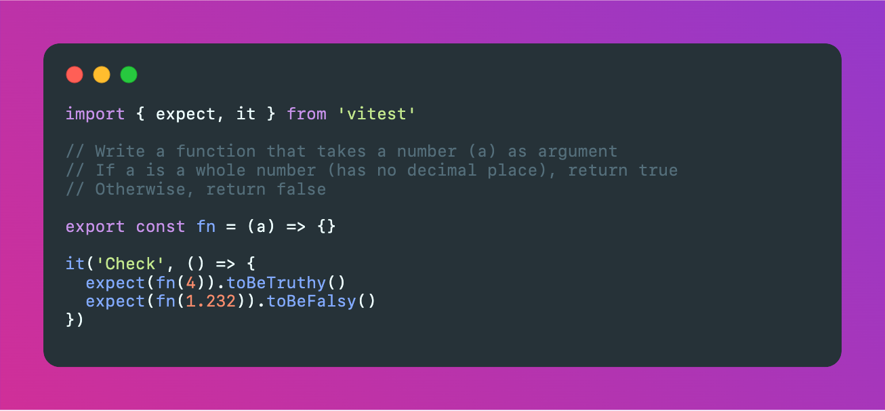

# JavaScript challenges

Learn JS by solving coding exercises.



## Get Started

```sh
# Install dependencies
npm install
# or
pnpm install

# Start challenge <category>/<number>
npm run c basics/01

# Start solution <category>/<number>
npm run c basics/01 -- -s
```

## Roadmap

- Collecting different exercises
- Advanced level

## Credits
- [Erik Kückelheim](https://www.erik-kueckelheim.com)
- Others free sources

## Licence

[MIT](https://github.com/antonreshetov/js-challenges/blob/master/LICENSE)

Copyright (c) 2022-present, [Anton Reshetov](https://github.com/antonreshetov)